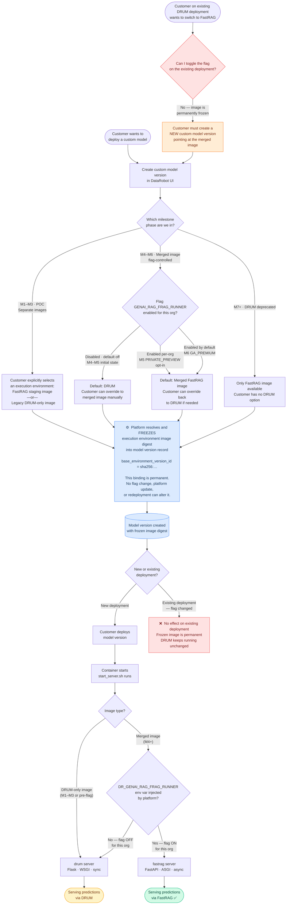

# FastRAG Rollout — Deployment Flowchart

## Reading the diagram

| Colour | Meaning |
|--------|---------|
| 🔵 Blue | Platform-side immutable operation (freeze) |
| 🟢 Green | FastRAG serving |
| 🟡 Yellow | Legacy DRUM serving |
| 🔴 Red | Dead end — this path doesn't work |

## Key insight

The feature flag `GENAI_RAG_FRAG_RUNNER` controls **which environment is the default when creating a new model version**.
It does **not** affect existing deployments. Because the image digest is frozen at model-version creation time,
a model built against the old DRUM image will always run DRUM — forever — regardless of any flag change.

"Opt-in" = creating a new model version. Not flipping a switch.
